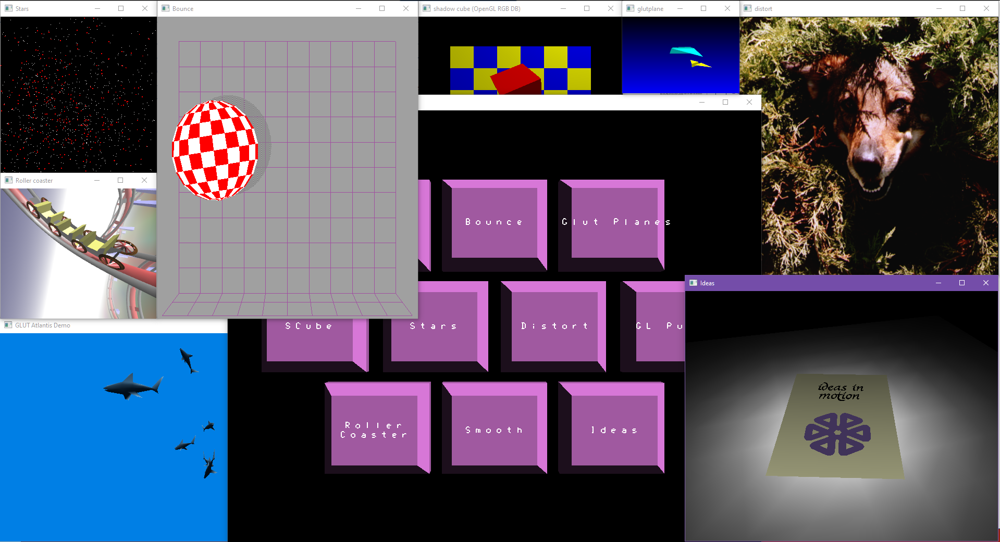

# Legacy OpenGL Demo Collection

A collection of classic OpenGL/GLUT demonstration programs showcasing various graphics techniques and effects from the early era of 3D computer graphics.


## Overview

This project contains several vintage OpenGL demos originally developed by Silicon Graphics, Inc. and other contributors in the 1990s. These demos demonstrate fundamental 3D graphics concepts using the fixed-function OpenGL pipeline and GLUT (OpenGL Utility Toolkit).

## Demos Included

### 🐟 Atlantis
An underwater scene featuring animated marine life including sharks, whales, and dolphins swimming in a 3D environment. Originally created by Silicon Graphics, Inc.

### 🎾 Bounce
An interactive 3D bouncing ball simulation with a graphical user interface. Features trackball rotation controls and real-time physics.

### 🦋 Buttonfly
A graphical menu/button system with IRIS GL compatibility layer. Includes its own parser and event handling system.

### 🎮 Demos Collection
A collection of smaller demos including:
- **bounce**: Ball physics demonstration
- **glutplane**: Airplane graphics demo
- **scube**: Spinning cube demonstration
- **stars**: Starfield effect
- **maze**: 3D maze navigation demo

### 🌀 Distort
Real-time image distortion effects including ripple and rubber-like deformations. Demonstrates texture manipulation techniques.

### 🧩 GL Puzzle
An interactive 3D puzzle game with trackball controls for manipulating pieces.

### 💡 Ideas
SGI "Ideas" logo demonstration featuring various 3D objects including lamps, holders, and animated logo elements.

### 🐛 Insect
An animated 3D insect simulation originally developed by Silicon Graphics, Inc. Features:
- Realistic multi-legged insect with articulated body parts
- Smooth walking animation with procedural leg movement
- Interactive camera controls (follow mode, free rotation)
- Checkered ground plane with customizable colors
- Shadow rendering for depth perception
- RGB color mode with indexed color palette simulation
- VSync support for smooth frame limiting

**Note**: This demo has been ported from the original X11/GLX implementation to work with GLUT on Windows using OpenGL legacy mode. The color system uses an in-memory palette that simulates the original indexed color mode while rendering in RGB mode for modern compatibility.

### 🎢 Roller Coaster
A 3D roller coaster simulation with camera following the track path. Includes custom matrix transformations.

### 🎨 Smooth
A sophisticated 3D model viewer supporting OBJ/MTL file formats. Features:
- Multiple rendering modes (wireframe, flat, smooth)
- Material and texture support
- Model manipulation with trackball controls
- Performance statistics
- Normal visualization

### 🏍️ Cycles
A solo or multiplayer motorcycle game where players navigate a maze while avoiding trails left by other players. Points are awarded for speed and causing others to crash.

## Prerequisites

- **CMake** 3.26.0 or higher
- **vcpkg** (for dependency management)
- **Visual Studio 2022** (on Windows) or compatible C/C++ compiler
- **OpenGL** compatible graphics card and drivers
- **FreeGLUT** 3.4.0 or higher (automatically installed via vcpkg)

## Building the Project

### Windows (Visual Studio)

1. **Setup vcpkg** (if not already installed):
   ```powershell
   git clone https://github.com/Microsoft/vcpkg.git
   cd vcpkg
   .\bootstrap-vcpkg.bat
   ```

2. **Set the VCPKG_ROOT environment variable**:
   ```powershell
   $env:VCPKG_ROOT = "C:\path\to\vcpkg"
   ```

3. **Clone and configure the project**:
   ```powershell
   git clone <repository-url>
   cd legacy_opengl_demo
   cmake --preset windows
   ```

4. **Build the project**:
   ```powershell
   cmake --build out/build/windows --config Debug
   ```

   Or open the generated solution file in Visual Studio:
   ```
   out/build/windows/OpenGL_Glut_Legacy_Demos.sln
   ```

### Linux/macOS

1. **Install dependencies**:
   ```bash
   # Ubuntu/Debian
   sudo apt-get install cmake build-essential freeglut3-dev

   # macOS (with Homebrew)
   brew install cmake freeglut
   ```

2. **Build the project**:
   ```bash
   mkdir build
   cd build
   cmake ..
   cmake --build .
   ```

## Running the Demos

After building, executables will be located in the build output directory:

```powershell
# Windows
.\out\build\windows\src\atlantis\Debug\atlantis.exe
.\out\build\windows\src\insect\Debug\insect.exe
.\out\build\windows\src\smooth\Debug\smooth.exe
.\out\build\windows\src\bounce\Debug\bounce.exe
# ... etc
```

### Model Viewer Usage (Smooth)

The smooth model viewer can load OBJ files with accompanying MTL material files:

```powershell
.\smooth.exe path\to\model.obj
```

Sample models are included in the `data/` directory:
- `cube.mtl` / OBJ
- `teapot.mtl` / OBJ
- `dolphin.mtl` / OBJ
- And more...

## Controls

Controls vary by demo. Common patterns:

- **Mouse**: Rotate/pan/zoom the view
- **Keyboard**: 
  - `ESC`: Exit
  - Various keys for demo-specific features
  - Check source code for specific bindings

## Project Structure

```
legacy_opengl_demo/
├── CMakeLists.txt           # Main build configuration
├── CMakePresets.json        # CMake presets for different platforms
├── vcpkg.json              # Dependency management
├── data/                   # Models, textures, and resources
│   ├── *.mtl              # Material files
│   ├── *.rgb              # SGI RGB texture files
│   └── buttonfly/         # Buttonfly menu resources
└── src/                   # Source code
    ├── atlantis/          # Atlantis demo
    ├── bounce/            # Bounce demo
    ├── buttonfly/         # Buttonfly system
    ├── demos/             # Mini demos collection
    ├── distort/           # Distortion effects
    ├── gl_puzzle/         # 3D puzzle game
    ├── ideas/             # SGI Ideas demo
    ├── insect/            # Insect animation demo
    ├── libtk/             # TK toolkit (X11/GLX to GLUT port)
    ├── roller_coaster/    # Roller coaster simulation
    └── smooth/            # Model viewer
```

## Credits

- **Silicon Graphics, Inc.**: Original developers of many of these demos
- **Mark J. Kilgard**: GLUT library and various demos
- **Nate Robins**: Model viewer (smooth) and GLM library
- **Various contributors**: Additional demos and utilities

## License

These demos retain their original licenses as specified in the source files. Most are provided "AS-IS" under permissive licenses from Silicon Graphics, Inc. and other contributors. See individual source files for specific copyright and license information.

## Historical Note

These demos represent an important period in computer graphics history when OpenGL was revolutionizing 3D graphics programming. While modern OpenGL uses programmable shaders instead of the fixed-function pipeline shown here, these demos remain valuable for:

- Learning fundamental 3D graphics concepts
- Understanding the evolution of graphics APIs
- Studying classic rendering techniques
- Educational purposes
- Nostalgia and historical preservation

## Porting Notes

### libtk Library (X11/GLX to GLUT)

The **libtk** library has been ported from X11/GLX to GLUT for Windows compatibility. Key changes include:

#### Color System Migration
- **Original**: Used indexed color mode (`glIndexi()`) with hardware color palette
- **Ported**: Simulates indexed colors in RGB mode using an in-memory palette array
- **Implementation**: `glIndexi_compat()` function translates color indices to RGB values via `tkGetColorRGB()`
- **Compatibility**: Functions like `tkSetOneColor()`, `tkSetRGBMap()`, `tkSetGreyRamp()`, and `tkSetFogRamp()` maintain the original API

#### Window Management
- **Original**: X11 `XCreateWindow()` and GLX context creation
- **Ported**: GLUT `glutCreateWindow()` with display mode conversion
- **Callbacks**: All X11 event handlers converted to GLUT callback wrappers (`glutDisplayFunc`, `glutReshapeFunc`, `glutKeyboardFunc`, etc.)
- **Mouse Tracking**: Custom mouse position tracking added since GLUT doesn't provide direct position queries

#### Cursor Support
- **Original**: X11 custom cursor creation and management
- **Ported**: Maps cursor IDs to GLUT predefined cursors (`GLUT_CURSOR_LEFT_ARROW`, etc.)
- **Limitation**: Custom cursor bitmaps not supported, uses closest GLUT equivalent

#### Display Lists
- Window type flags (`TK_INDEX`, `TK_RGB`, `TK_DOUBLE`, etc.) converted to GLUT equivalents
- Z-buffer, double buffering, and direct rendering modes preserved
- Overlay planes support limited (GLUT has minimal overlay support)

#### Frame Rate Control
- Added VSync support via WGL extensions (`wglSwapIntervalEXT`) on Windows
- Prevents excessive frame rates when VSync is unavailable in driver settings
- Maintains smooth animation at monitor refresh rate

### Insect Demo Conversion

The insect demo required additional modifications:
- All `glIndexi()` calls replaced with `glIndexi_compat()` for RGB mode compatibility
- Color initialization moved earlier in startup sequence
- Display mode changed from `TK_INDEX` to `TK_RGB|TK_DOUBLE|TK_DIRECT|TK_DEPTH`
- Include order fixed: `windows.h` must precede OpenGL headers to define `WINGDIAPI` and `APIENTRY` macros
- Checkered floor rendering modified to draw both colors instead of using background transparency
- Screen resolution variables made dynamic (`actualScreenWidth`, `actualScreenHeight`)

These changes preserve the original visual appearance and behavior while enabling the code to run on modern Windows systems with current OpenGL drivers that no longer support hardware indexed color modes.

## Contributing

Contributions are welcome! Please ensure that:
- Code compiles without warnings
- Existing functionality is preserved
- Changes are documented

## Support

For issues or questions, please open an issue on the project repository.

---

*These classic demos have been preserved and modernized to build with contemporary build systems while maintaining their original visual charm and educational value.*
