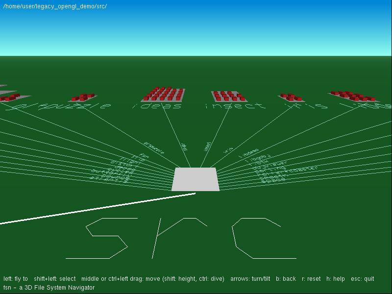

# fsn - 3D File System Navigator



`fsn` is Silicon Graphics' 3D file system browser (version 1.2, (c) 1992, 1993,
1996 Silicon Graphics, Inc.), made famous by the "It's a UNIX system!" scene of
Jurassic Park. Directories are platforms laid out as a tree that recedes into
the distance, files are boxes standing on them. A file's height shows its size
and its color shows its age.

## How this port was made

No source code of fsn was ever published. This version was rebuilt from the
IRIX 5.x executable (32-bit big-endian MIPS ELF, linked against IRIS GL and
Motif):

- The binary is stripped, but IRIX keeps about 290 function names and 120
  global names in its dynamic symbol table (`draw_directory`, `layout_db`,
  `zoomto`, `spotlight`, ...).
- The code was disassembled (GOT and string references resolved) and
  decompiled with angr. The floating-point code was translated by hand from
  the disassembly.
- The Xt resource table and the fallback resources in the binary give the name
  and default value of every parameter (heights, margins, distances, colors,
  landscapes).
- The stroke font used for the labels (`chrtbl`) was extracted as is into
  `fsn_font.h`. It draws `_` as a left arrow, like the original.

The port keeps the original algorithms, constants and function names. IRIS GL
calls are mapped to OpenGL 1.x (`pick`/`gselect` become `GL_SELECT`,
`setpattern` becomes polygon stipple) and Motif/Xt is replaced by GLUT.

## What is ported

- File system scan: name, size and modification time. Files are sorted by
  name, symbolic links are not followed and other file systems are not entered.
- Layout (`layout_db`, `first_traversal`, `second_traversal`,
  `third_traversal`): file grid, the lateral shrinkage
  `pow(shrinkagePower, y / shrinkageDistance)`, the side-by-side placement of
  subtrees, and where the lines leave the parent platform.
- Rendering (`draw_scene`, `draw_directories`, `draw_directory`, `draw_files`,
  `draw_file`, `draw_box`):
  - sky and ground gradients;
  - level of detail by distance (box, plane or line);
  - directories drawn as "carpets" in their dominant color when far away;
  - names of files, directories and lines;
  - the spotlight on the selected file, and the arrows to the next file of the
    row.
- Colors (`makeColorBox`, `makeDColorBox`): each color is shaded in HSV for
  the top, front, back and side faces, with selected and unselected variants.
- Visibility (`draw_visibility`): frustum test plus `directoryHideRatio`.
- Picking (`pickLandscape`): two passes, like the original.
- Flying (`zoomto`, `findzoom_landscape`): animation timed by `zoomSpeed` and
  `minNumZoomSteps`, files shrinking after a zoom (`shrinkOnZoom`), and a
  10-position history for "back".
- Mouse "joystick" movement (`mousemark`, `mousemove`, `mousemovevert`,
  `mousemovemvert`).
- The landscapes `grass`, `indigo`, `desert`, `ocean` and `space`.

Not ported:
- the Motif control panel and dialogs (replaced by a GLUT menu and keys);
- FAM monitoring and the compressed database cache (`~/.FSN_*`);
- file typing icons (they need IRIX's `/usr/lib/filetype` rules);
- warp mode, the overview window, marks and search.

## Usage

```
fsn [-landscape grass|indigo|desert|ocean|space] [directory]
```

Without a directory, fsn shows your home directory.

| Input | Action |
| --- | --- |
| Left click | fly to the directory, file or line under the cursor |
| Shift + left click | select without flying |
| Middle drag (or Ctrl + left drag) | move: up/down goes forward/back, left/right goes sideways |
| Shift + middle drag | move along the view, faster when high |
| Ctrl + middle drag | dive |
| Arrow keys | turn left/right, tilt up/down |
| Page Up / Page Down | go up / down |
| `+` / `-` | narrower / wider view angle |
| `b` | back to the previous position |
| `r` | reset the view |
| `n` / `l` / `e` | no height / linear height / exaggerated height |
| `h` | show or hide the help line |
| Right button | menu (landscape, height, shrink on zoom, ...) |
| `Esc` / `q` | quit |

Colors give the age of a file: red is less than a week old, then orange,
yellow, teal, blue and purple, up to a dark raspberry color for files older than a year.
